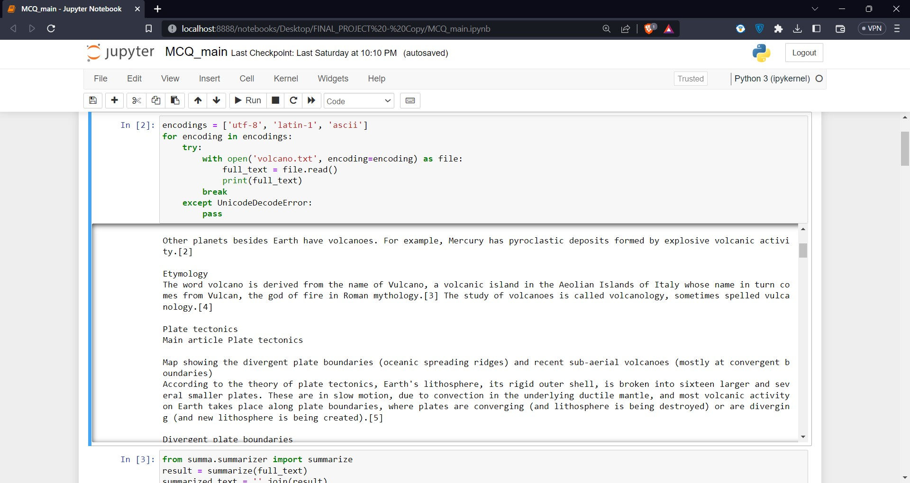
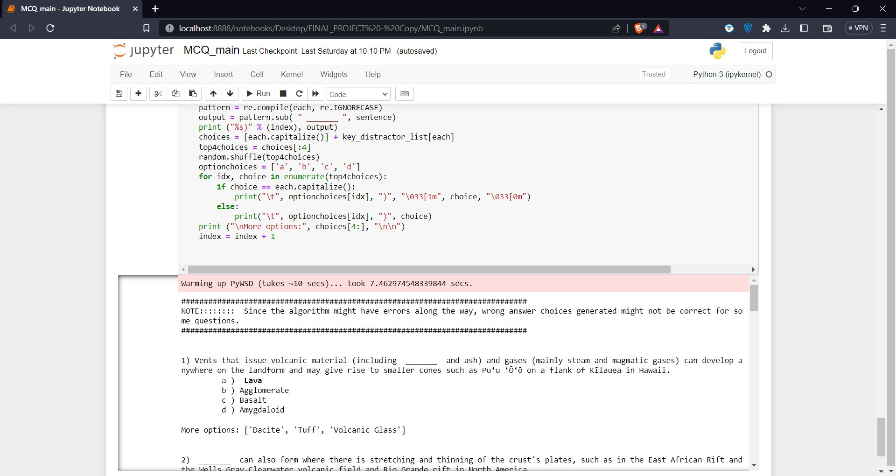

# MCQ Generation using NLP

MCQ Generation using NLP is a project that automates the process of generating multiple-choice questions using Natural Language Processing (NLP) techniques. This project aims to facilitate the assessment process by providing educators with a tool to quickly generate relevant and meaningful questions from text.

## Features

- Text Summarization: Automatically condenses lengthy passages into concise summaries to focus on key information.
- Keyword Extraction: Extracts important keywords and phrases from the summarized text for question generation.
- Sentence Tokenization: Breaks down the summarized text into individual sentences for analysis and question generation.
- Distractor Generation: Generates plausible but incorrect answer options to challenge learners effectively.
- Word Sense Disambiguation: Determines the appropriate sense of words in the given context for accurate question generation.
- ConceptNet Integration: Expands the pool of distractor choices using ConceptNet, a knowledge graph.
- User-Friendly Interface: Provides an intuitive interface for easy input of text and generation of MCQs.

## Technologies

- Python
- ConceptNet
- [Spacy](https://spacy.io/)
- [NLTK](https://www.nltk.org/)
- [FlashText](https://pypi.org/project/flashtext/)
- [Summa](https://github.com/summanlp/textrank)
- [YAKE](https://github.com/LIAAD/yake)
- [PyWSD](https://github.com/alvations/pywsd)

## Installation

1. Clone the repository: `git clone https://github.com/thesatender/mcq-generation-nlp.git`
2. Navigate to the project directory: `cd mcq-generation-nlp`
3. Install the required dependencies: `pip install -r requirements.txt`

## Usage

1. Ensure you have Python installed (version 3.9.7 or higher).
2. Run the main script: `python main.py`
3. Follow the instructions in the terminal to input the text and adjust parameters.
4. The generated MCQs will be displayed, including the questions, answer choices, and additional distractor options.

## Screenshots

1. Input Screenshot:
   

2. Output Screenshot:
   

## Contributing

Contributions are welcome! If you would like to contribute to this project, please follow these steps:

1. Fork the repository.
2. Create a new branch: `git checkout -b feature/your-feature-name`
3. Make your changes and commit them: `git commit -m 'Add some feature'`
4. Push to the branch: `git push origin feature/your-feature-name`
5. Submit a pull request detailing your changes.

## Acknowledgments

- [YAKE! Keyword Extraction Library](https://github.com/LIAAD/yake) - Used for keyword extraction.
- [pywsd](https://github.com/alvations/pywsd) - Used for word sense disambiguation.
- [ConceptNet](https://github.com/commonsense/conceptnet5/wiki) - Used for expanding distractor choices.

## Contact

For any questions or inquiries, please contact [satender80010336@gmail.com](mailto:satender80010336@gmail.com).